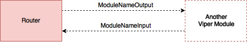

# Содержание:  
- Основная информация  
- Общая структура
- Presentation слой
- Координаторы
- Общение между составными частями
- Общение между модулями
- Core слой
- Service слой
- Сабмодули

В наших проектах повсеместно используется Viper + SOA  

Общую информацию можно узнать по ссылкам ниже, здесь будут только тонкости нашей реализации и хаки:  

* [Доклады Viper](https://www.youtube.com/playlist?list=PL7JJcdGH5aCGwJqbxaXERUHnfVkRLcIiN) с конференций
* [Книга Viper](https://github.com/strongself/The-Book-of-VIPER) по VIPER  
* [Доклады SOA](https://www.youtube.com/watch?v=_kPz7MrejPA)
* [Статья SOA](https://habrahabr.ru/company/redmadrobot/blog/246551/)

# Основная структура


Мы используем SOA, общую информацию можно узнать по ссылкам выше
Краткое описание процесса:  
- В `Interactor` инжектируются необходимые Service'ы
- `Interactor` запрашивает данные с Service слоя
- В `Service` слой инжектируются рабочие лошадки с Core слоя
- `Service`, обрабатывает запрос `Interactor` и возвращает необходимые данные обратно, через callback
- Общение между слоями происходит согласно принципу "dependency inversion principle, DIP"

# Presentation слой

Пунктир - `weak` связь  
Сплошная - `strong` связь 

За memory management отвечает UIKit. Модуль будет жить до тех пор, пока живая его `view`.


**Общение между составными частями**  

Над стрелками написан нейминг для протоколов связи между блоками  
Минимальная составляющая каждого модуля - `view` часть, все остальное - опционально  


`view` - наследник `UIView`, `UIViewController`, `UIBarButtonItem` и т.д.  


# Общение между модулями  
Общение между модулями происходит через `Router'ы`, посредством протоколов `ModuleInput/ModuleOutput`  

  

Ситуации, когда такого подхода лучше избегать:
- Необходимо шарить локальные данные между большим количеством модулей
- Необходмо, чтобы модули реагировали на изменение данных  

Для таких случаев есть 2 пути решения проблемы:

- Положить необходимые данные в базу, и для их шеринга использовать соответствующие сервисы 
- Держать данные в неком сервисе(не обязательно в синглтоне), который будет жить пока он необходим. Создать в нем сет с делегатами, через `NSPointerArray`. Когда данные будут изменяться, сервис будет посылать всем своим делегатам, сообщение об изменении. Если в проекте используется Rx, то подобное можно реализовать через него  

# Core слой

`Core` слой представляет из себя набор основных рабочих "кирпичиков", отвечающих за работу с данными и сетью. Эти кирпичики обычно инжектируются при создании сервисов. Все core модули должны быть закрыта протоколами. Это крайне важно, для того чтобы в проекте без особой боли можно было заменить Core Data на Realm или самописный NetworkClient на Alamofire.  

`Core` в идеале должен шарится между проектами, то есть его компоненты не должны зависеть от требований конкретного проекта.

  


# Service слой  

# Сабмодули  

Иногда бывает необходимо добавлять сабмодули, у которых `view` не является наследником `UIViewController`. К примеру имеется сложная ячейка таблицы со своей логикой, которую не хочется выносить в interactor или presenter. Так-же, если подобный элемент переиспользуется на многих экранах выгодно вынести его в отдельный VIPER модуль.  

Общее отображение сабмодуля выглядит примерно так:
```swift
class Presenter {
	
	var router: Router?
	private let additionalData: Any	

	func foo() {
		// Запрашиваем некий холст на котором будет отображен модуль
		let canvasView: UIView = view.getCanvasView()
		// Говорим роутеру, чтобы он показал новый модуль
		router?.setSubModule(canvasView: canvasView, additionalData: additionalData)
	}
	
}
```

Рассмотрим конкретные случаи реализации:  

Самый распространенный вариант, это когда необходимо в качестве сабмодуля использовать ячейку коллекции или таблицы. Как в таком случае запросить у еще неготовой таблицы canvas для отображения сабмодуля? К тому же, ячейки штука довольно динамическая и зависит от множества внешних факторов. 

Для такого случая нам нужна ячейка, которая будет сообщать `presenter` о своей готовности и передавать ему canvas для отображения.

```swift
class TableViewCell: UITableViewCell, Delegatable {
  
    private var canvasView: UIView?
    weak var delegate: SubModulePresenterBridge?
   
    override init(style: UITableViewCellStyle, reuseIdentifier: String?) {
        super.init(style: style, reuseIdentifier: reuseIdentifier)
        drawSelf()
    }
    
    required init?(coder aDecoder: NSCoder) {
        super.init(coder: aDecoder)
        drawSelf()
    }
    
    private func drawSelf() {
        //1
        let view = UIView()
        contentView.addSubview(view)
        view.autoPinEdgesToSuperviewEdges()
        canvasView = view
    }
    
}

extension TableViewCell: Setupable {
    //2
    func setup(_ model: ViewModel) {
        guard let canvas = canvasView else { return }
        delegate?.setSubModule(сanvasView: canvas, additionalData: model)
    }   
}
```

 1. Создаем canvas для отображения сабмодуля
 2.  Во время установления параметров, используем `presenter` в качестве прокси для `router`

Может показаться, что теперь `view`  является инициатором, для создания нового модуля, но это не совсем так. Так-как подготовкой данных для `view`  занимается `presenter`, то сам `presenter` является инициатором создания подобной ячейки, которая возвращает обратно canvas.  

Появляется закономерность, что для добавления сабмодуля, у `presenter` и `router` должны быть соответствующие методы `setSubModule(сanvasView: UIView, additionalData: Any)`. Тут приходит на помощь сила Swift и его протоколов. В итоге, для добавления нового модуля необходимо добавить 2 протокола:  

```swift
protocol SubModuleRouterBridge: class {
    func setSubModule(сanvasView: UIView, additionalData: Any)
}

protocol SubModulePresenterBridge: class {
    func setSubModule(сanvasView: UIView, additionalData: Any)
}
```

Как упоминалось ранее, мы хотим переиспользовать эти сабмодули в других местах приложения с минимальным количеством кода в верхнем модуле. Для этого нам помогут extensions.


```swift
extension SubModuleRouterBridge {
    
    func setSubModule(сanvasView: UIView, additionalData: Any) {
        let view = SubModuleAssembly.assembleModule(with: additionalData)
        canvas.addSubview(view)
        view.autoPinEdgesToSuperviewEdges()
    }
    
}
```  

Окей, круто, но если мы хотим использовать для отдельного модуля отдельный набор протоколов `SubModulePresenterBridge`, `SubModuleRouterBridge`, то в `presenter` необходимо вызывать конкретный `router` и такая штука не пройдет:

```swift
protocol SubModulePresenterBridge: class {
    var router: SubModuleRouterBridge { get set }
    func setSubModule(сanvasView: UIView, additionalData: Any)
}
```  

На помощь опять приходит сила Swift и его mirror API. 

```swift
protocol BasePresenterBridge: class {  }

extension BasePresenterBridge {
    
    func reflectRouter<T>() -> T? {
        let mirror = Mirror(reflecting: self)
        return mirror.children.filter { $0.label == "router"}.first?.value as? T
    }
    
}
```

Код выше дает возможность достать `router` прямо из extension `SubModulePresenterBridge`. В итоге получаем:  

```swift
protocol SubModulePresenterBridge: BasePresenterBridge {
    func setSubModule(сanvasView: UIView, additionalData: Any)
}

extension SubModulePresenterBridge {
    
    func setSubModule(сanvasView: UIView, additionalData: Any) {
        let router: SubModuleRouterBridge? = reflectRouter()
        router?.setSubModule(сanvasView: canvas, additionalData: additionalData)
    }
    
}
```  

Так... и что нам это дало? А вот что, теперь для того чтобы подключить сабмодуль, необходимо добавить следующий код:

```swift
class Presenter: SubModulePresenterBridge {  }
class Router: SubModuleRouterBridge {  }
```

Вот собственно и все, теперь наш модуль поддерживает локику добавления другого сабмодуля.