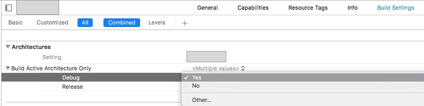
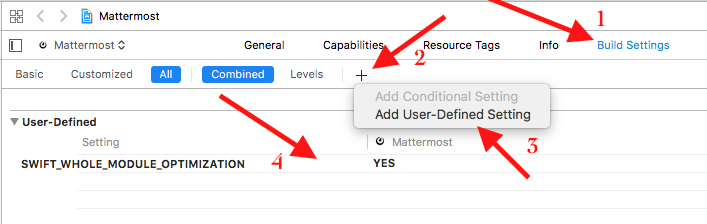
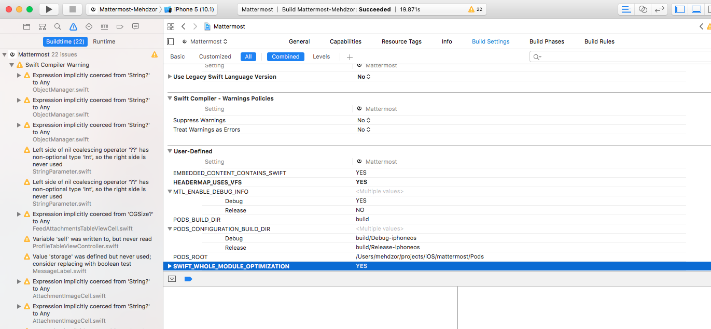

**1.  Установить Build Time Analyzer**  
Помогает следить за временем компиляции и выявлять "тяжелые" места проекта.
https://github.com/RobertGummesson/BuildTimeAnalyzer-for-Xcode


**2. Сборка только выбранной архитектуры для Debug-билдов**  


В debug-сборке происходит компиляция проекта только для архитектуры устройства, выбранного для отладки. То есть, выбирая здесь Yes, мы теоретически ускоряем время сборки в два раза.

Поскольку в нашем проекте этот флаг уже был установлен в Yes, мы не добились выигрыша в этом пункте. Но ради эксперимента мы опробовали сборку с флагом, выставленным в No. Для этого пришлось повозиться с Pod’ами, потому что они тоже были готовы предоставить скомпилированный код только для активной архитектуры. Время сборки проекта в итоге составило 10 минут 21 секунду, что действительно почти в два раза больше, чем изначальное.  

**3. Whole Module Optimization**  

В настройках оптимизации есть такой флаг как whole-module-optimization. При этом флаге компилятор рассматривает проект как единое целое, целиком видит все имеющиеся функции и экономит на лишних кастованиях типов.  

Необходимо добавить флаг SWIFT_WHOLE_MODULE_OPTIMIZATION=YES в user-defined-settings.  



Результат:  


**4. Разгон Cocoapods**

Наверное, многие замечали, что кроме самой компиляции еще много времени уходит на разные 'shell scripts':  


При использовании cocoapods и/или carthage их даже несколько. На их выполнение уходит от 3 до 10 секунд каждый раз в зависимости от скорости вашего диска, процессора и положения звезд на небе. Cocoapods прописывает себя туда автоматически, а для Carthage приходится это делать вручную.
Немного изучив контент, мы выяснили, что эти скрипты занимаются ничем другим как копированием своих ресурсов в сборочную директорию проекта. При этом они не заботятся о том были уже скопированы этих файлы или нет. Хотя, гораздо логичнее было бы проверять наличие нужных ресурсов перед их повторным копированием.  

Так же ускоряем скорость сборки по принципу из предыдущего пункта.

Так как скрипты генерируются автоматически, придется добавить немного магии в Podfile. Чтобы это сделать, докинем следующие строки в самый конец файла:  

```ruby
post_install do |installer|
    
    installer.pods_project.targets.each do |target|
        target.build_configurations.each do |config|
            
            if config.name == 'Debug'
                config.build_settings['OTHER_SWIFT_FLAGS'] = ['$(inherited)', '-Onone']
                config.build_settings['SWIFT_OPTIMIZATION_LEVEL'] = '-Owholemodule'
            end
            
        end
    end
    
    Dir.glob(installer.sandbox.target_support_files_root + "Pods-*/*.sh").each do |script|
        flag_name = File.basename(script, ".sh") + "-Installation-Flag"
        folder = "${TARGET_BUILD_DIR}/${UNLOCALIZED_RESOURCES_FOLDER_PATH}"
        file = File.join(folder, flag_name)
        content = File.read(script)
        content.gsub!(/set -e/, "set -e\nKG_FILE=\"#{file}\"\nif [ -f \"$KG_FILE\" ]; then exit 0; fi\nmkdir -p \"#{folder}\"\ntouch \"$KG_FILE\"")
        File.write(script, content)
    end
    
    
end
```

Принцип работы этого скрипта: он добавляет в скрипты копирования ресурсов проверку на файл-флаг. При этом не меняет build phases, а сразу изменяет сам скрипт cocoapods.

Кстати, если у вас уже был задействован блок post_install, то не надо создавать еще один, достаточно поместить скрипт внутрь уже имеющегося.

Теперь можно сделать 'pod install', чтобы изменения вступили в силу. При редактировании Podfile нужен полный clean проекта перед запуском.  

**Линки:**  

*  https://habrahabr.ru/company/tinkoff/blog/331044/
*  https://habrahabr.ru/post/317650/
*  https://habrahabr.ru/post/316986/
*  https://habrahabr.ru/post/317298/
*  https://github.com/fastred/Optimizing-Swift-Build-Times
