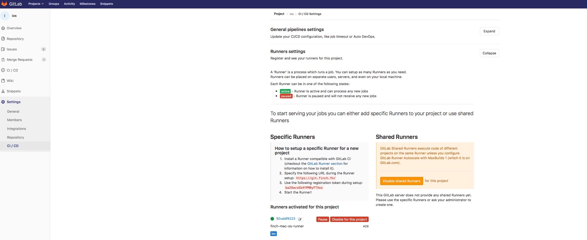

Для отправления сборок используется fastlane

# Интро

[Статья](https://www.raywenderlich.com/136168/fastlane-tutorial-getting-started-2) для начального ознакомления 


# Настройка Git CI

Единственное дополнение по этой статье в том, что сборка происходит на удаленной машине, поэтому необходимо для нужного проекта установить runner  
  

как на картинке выше  


Для того чтобы все работало, через коммиты в гите, необходимо добавить файл .gitlab-ci.yml в корень проекта и описать его по примеру снизу  

```YAML
stages:
  - build
  - build_report

variables:
  group: stoloto
  project: ios

build_job:
  stage: build
  script:
    - branch=$(git ls-remote --heads origin | grep $(git rev-parse HEAD) | cut -d / -f 3)
    - commit=$(git log --format=%B -n 1 | sed ':a;N;$!ba;s/\n/ /g' | sed 's/ /%20/g')
    - commitmessage=$(git log --format=%B -n 1 | sed ':a;N;$!ba;s/\n/ /g' | sed 's/ /%20/g' | sed 's/#ci_dev_build%20//g' | sed 's/#ci_prod_build%20//g' )
    - author=$(git --no-pager show -s --format='%an <%ae>' | sed 's/ /%20/g')
    - buildOn=false
    - >
      if [[ ${commit} == *#ci_dev_build* || ${commit} == *#ci_prod_build* ]]; then
          buildOn=true
      fi
    - >
      if [ "$buildOn" == 'false' ];
      then
          exit 0
      fi
    - curl -g https://api.telegram.org/bot323277544:AAGb_gMsf07F2x4PzAhQXNiKL8Qbk5zhWdc/sendMessage\?chat_id=-1001302491618\&text\=\*Building\*%20\[$project\]\(https://git.finch.fm/$group/$project/pipelines\)\($branch\)%20by%20$author%20-%20$commitmessage
    - |
      if [[ ${commit} == *#ci_dev_build* ]]; then
          fastlane dev_build
      fi
      if [[ ${commit} == *#ci_prod_build* ]]; then
          fastlane prod_build
      fi

success_info_job:
  stage: build_report
  script:
    - buildOn=false
    - branch=$(git ls-remote --heads origin | grep $(git rev-parse HEAD) | cut -d / -f 3)
    - commit=$(git log --format=%B -n 1 | sed ':a;N;$!ba;s/\n/ /g' | sed 's/ /%20/g')
    - >
      if [[ ${commit} == *#ci_dev_build* || ${commit} == *#ci_prod_build* ]]; then
          buildOn=true
      fi
    - >
      if [ "$buildOn" == 'false' ];
      then
          exit 0
      fi
    - curl -g https://api.telegram.org/bot323277544:AAGb_gMsf07F2x4PzAhQXNiKL8Qbk5zhWdc/sendMessage\?chat_id=-1001302491618\&text\=\*Success\*%20\[$project\]\(https://git.finch.fm/$group/$project/pipelines\)\($branch\)
  when: on_success

fail_info_job:
  stage: build_report
  script:
    - buildOn=false
    - branch=$(git ls-remote --heads origin | grep $(git rev-parse HEAD) | cut -d / -f 3)
    - commit=$(git log --format=%B -n 1 | sed ':a;N;$!ba;s/\n/ /g' | sed 's/ /%20/g')
    - >
      if [[ ${commit} == *#ci_dev_build* || ${commit} == *#ci_prod_build* ]]; then
          buildOn=true
      fi
    - >
      if [ "$buildOn" == 'false' ];
      then
          exit 0
      fi
    - curl -g https://api.telegram.org/bot323277544:AAGb_gMsf07F2x4PzAhQXNiKL8Qbk5zhWdc/sendMessage\?chat_id=-1001302491618\&text\=\*UnSuccess\*%20\[$project\]\(https://git.finch.fm/$group/$project/pipelines\)\($branch\)
  when: on_failure

```

# Переустановка fastlane

Переодически fastlane при update, ставит еще один fastlane на машину и из-за этого возникают проблеммы, чтобы этого избежать перед следующим update необходимо полностью удалить старую версию:  

```
rvm @global do gem uninstall fastlane 
rvm all do gem uninstall fastlane
gem uninstall fastlane
```

Затем можно устанавливать fastlane по новой:  

```
sudo gem install fastlane
```