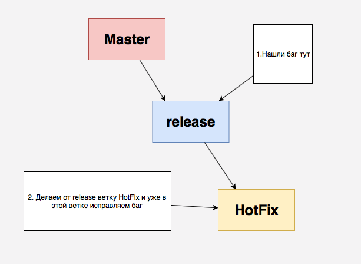

 Что делать если нужно срочно поправить баг, который находится в релизной ветке?
 

1. Если вы плохо знакомы с GitFlow, то существует хорошая
 [шпаргалка по GitFlow](https://danielkummer.github.io/git-flow-cheatsheet/index.ru_RU.html)

 Однако лучше делать hotfix не из мастера, а другим способом
 
2.   

и затем уже обратно мержим release ветку с hotfix. Таким образом ветка release собирает в себе все исправления связанные с багами.