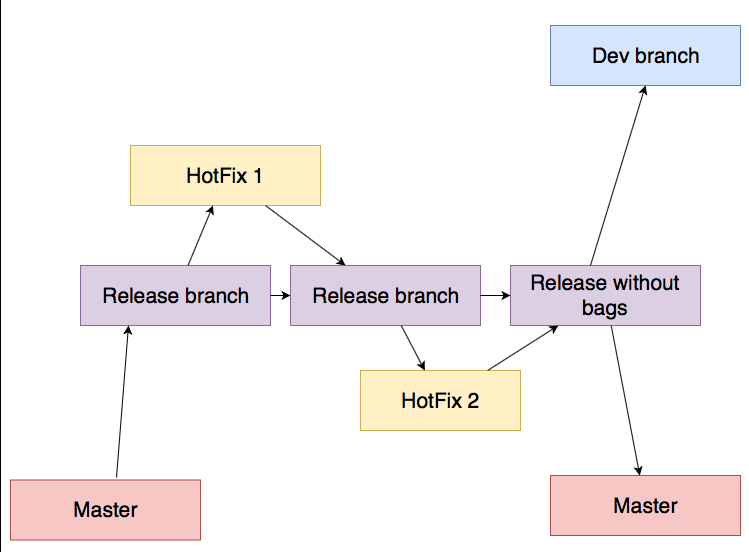

 Что делать если нужно срочно поправить баг, который находится в релизной ветке?
 

1. Если вы плохо знакомы с GitFlow, то существует хорошая
 [шпаргалка по GitFlow](https://danielkummer.github.io/git-flow-cheatsheet/index.ru_RU.html)

 
**Работа с hotfix может осуществляться по-разному, в зависимости от ветки с которой происходит release**

*Release from dev*

  

Суть в том, что hotfix всегда идет из release ветки и в конце обратно мержится в эту же release ветку, после чего release ветка мержиться обратно с dev

*Release from master*

Из release отходят ветки связянные с ликвидацией багов. Каждая hotFix ветка поэтапно мержиться обратно с release веткой (по мере устранения бага). Таким образом release ветка поэтапно собирает в себе версию без багов и конце release идет в дев и в мастер ветки.   