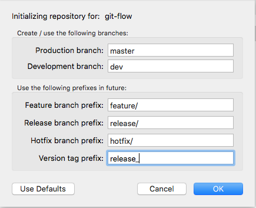
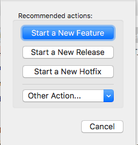
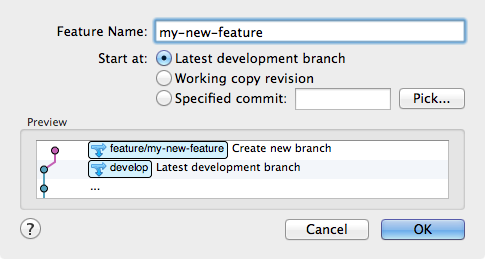
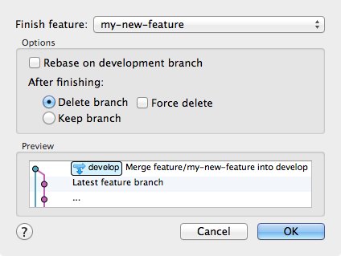

 Сначала нужно зайти в Sourcetree 

 Затем нажать Cmd-Alt-F и появится окно с настройками Git flow 

 
 В каждом поле можно прописать свои названия для папок, где будут хранится ветки для релиза или фич, но лучше оставить все как есть, 

 Если вы находитесь в dev и вам нужно срочно запилить новую фичу или что-либо еще, то нажмите на кнопку git flow или Cmd-Alt-F и откроется новое окно 

нажмите к примеру на Start a new feature 

Введите навзание фичи (что в последующем будет названием для ветки) и нажмите ОК. 

Аналогичные действия совершаются и для других веток, таких как release или hotfix.

В конце концов, когда вы закончите реализацию фичи, используйте действие «Finish Feature» (опять же, это будет действие по умолчанию на панели инструментов, если вы находитесь в ветви функции)

Предварительный просмотр показывает вам, что произойдет - если ветвь фичи будет сливаться в основную ветвь разработки, по сути, ее очередь для включения в следующую версию. По умолчанию ветви функций удаляются, но вы можете сохранить их, если хотите.
 